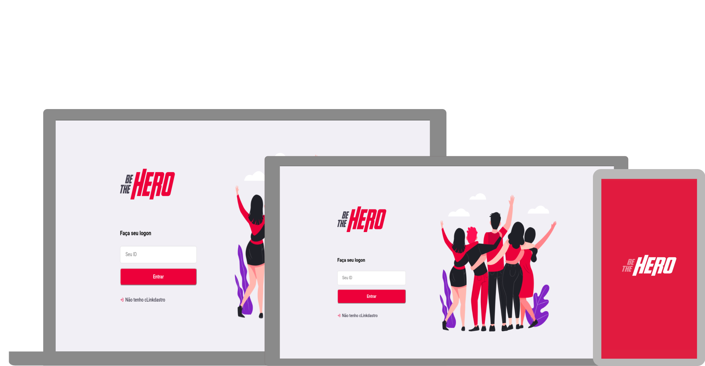

# BE-THE-HERO

Aplicação para ONG's postarem seus casos

## TASK DO PROJETOS

### BACKEND

- [X] Nodejs & Expres
- - [X] Routas e recursos
- - [X] Métodos HTTP
- - [X] Tipos de parâmetros
- [X] Utilizando o insomnia
- [X] Configuração Nodemon
- [X] Diferenças entre banco de dados
- [X] Configurando banco de dados
- [X] Pensandonas entidades e funcionalidades 
- [X] Construção do backend
- [X] Adicionando módulo CORS
- [X] Enviando back-end ao Github

## ENTIDADES

- [X] Ong
- [X] Caso (incident)

## FUNCIONALIDADE

- [X] Login ONG
- [X] Logout ONG
- [X] Cadastro de ONG
- [X] Cadastro novos casos
- [X] Deletar casos
- [X] Listar casos específicos da ONG
- [X] Listar todos os casos
- [X] Entrar em contato com a ONG 

# Database SQLite

[knex](http://knexjs.org/)

### FRONTEND

- [X] Limpando estrutura
- [X] Conceitos do React
- - [X]Componente
- - [X]JSX
- - [X]Propriedades
- - [X]Estado
- - [X]Imutabilidade
- [X] Configurando rotas
- [X] Cadastro de ONGs
- [X] Listagem de casos
- [X] Cadastro de um novo caso
- [X] Conectando aplicação à API
- [X] Enviar projeto ao Github
